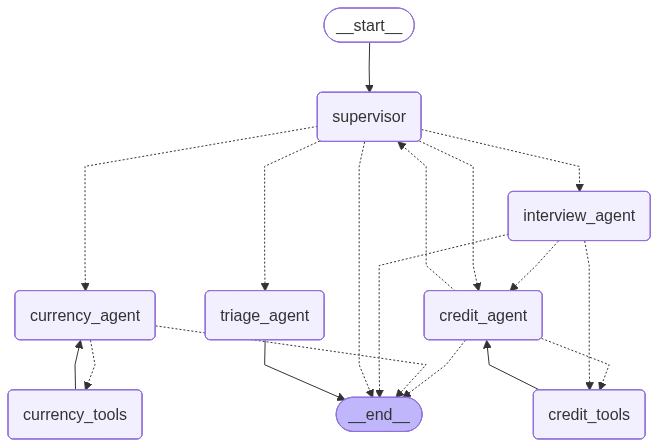

# Rito Bank AI Agent

This project is an intelligent banking customer service system built on a multi-agent architecture. The system uses Large Language Models (LLMs) orchestrated by a state graph to perform triage, authentication, credit analysis, financial profile interviews, and currency exchange quotations.

## Project Overview

This project aims to build an AI agent that functions as a banking assistant. Unlike traditional chatbots, which are quite limited and lack logical reasoning capabilities in conversations, this agent attempts to overcome these limitations. The name "Rito" was chosen randomly as an identifier for the agent.

## System Architecture

The system was built using Python 3.12 and follows a modular architecture based on Graphs and Services.

### Agents and Workflows
Orchestration is implemented through a State Graph (StateGraph), where each node represents a specialized agent or control function. Here are some detailed specifications of how they were built:

1. **Supervisor (Router):** The entry point of the system. It analyzes the user's message intent and decides which specialized agent to route the request to (Triage, Credit, Currency Exchange) or whether to respond directly. It has some fixed conditionals that redirect the conversation flow directly to another state. For example, when a customer is not authenticated, they are automatically redirected to the triage node.

2. **Triage Agent:** Responsible for security. Manages the authentication flow by requesting CPF and Date of Birth, validating them against the database before allowing access to sensitive data. Its operation follows the state attribute conditions, preventing the LLM from managing authentication using only conversation history. It uses retry mechanisms and tool calls to trigger authentication services.

3. **Credit Agent:** Queries credit scores and limits. Contains business logic to approve or reject limit increases based on predefined rules (score tables). If a request is rejected, it can suggest an interview. It can inform your credit and score information, and offer the possibility of a credit increase. If rejected, it can ask if you want to do an interview. The LLM used in this node also has some integrated tools.

4. **Interview Agent:** Activated when the customer wants to renegotiate or update their data. Collects financial information (income, expenses) conversationally and updates the customer's score. Unlike the triage agent, this agent conducts the entire interview based on past messages. Therefore, passing more historical messages to the model invocation was necessary.

5. **Currency Exchange Agent:** Uses tools to query exchange rates and performs conversion calculations between foreign currencies and the Brazilian Real. It was implemented in a way that allows the node to call the tool more than once, since the customer can ask about the value of two or more currencies without necessarily relating to the Real.

### Data Management
* **Shared State:** A typed dictionary (TypedDict) flows between agents containing message history, authentication data (CPF, status), and control flags.
* **Service Layer:** Heavy logic does not reside in the LLM. Service classes (`CreditService`, `UserService`) exist to manipulate CSV files (`clients.csv`, `score_limit.csv`) using Pandas. This ensures that the AI only requests actions, while execution and data validation are deterministic and secure. The `ModelService` class is responsible for message exchange services with the agent. Within it, an object is initialized that persists in memory to be used as state. This implementation is for testing purposes only.
* **Persistence:** Changes (such as new limits or updated scores) are physically written to CSV files, ensuring data persists between sessions.

## Implemented Features

* **Conversational Authentication:** Credential validation (CPF and Date of Birth) with error handling and attempt limits.
* **Credit Limit and Score Query:** Real-time reading of customer data.
* **Limit Increase Request:** Automatic analysis based on score ranges. If the requested amount is within the CSV rules, it is approved and updated immediately.
* **Profile Interview:** Data collection flow (Income, Employment, Dependents) that dynamically recalculates the customer's score.
* **Currency Conversion (ReAct):** Ability to query exchange rates and perform mathematical calculations for conversion between different currencies.
* **Conversation History:** The system maintains short-term memory of interactions to provide contextualized responses.

The diagram below represents the exact structure of the agents and their transitions, automatically generated from the compiled LangGraph code:




## Technical Challenges and Architectural Decisions

### 1. Model Selection Strategy and Hallucination Mitigation
**Challenge:** In an orchestration-based architecture (Supervisor), the risk of incorrect routing or hallucination in tool calling is critical. The choice of model cannot be arbitrary; it defines the system's reliability.

**Approach:** The decision focused on balancing latency and logical reasoning capabilities. We opted for models with strong *function calling* capabilities to ensure that the Supervisor node's decision-making was accurate, minimizing false positives in intent routing. This ensured that the agent not only "converses well" but also executes business actions (open ticket, query credit) with deterministic precision.

### 2. Granular State Orchestration and Data Flow
**Challenge:** Managing shared context between specialist agents without polluting short-term memory or losing critical data during transitions.

**Approach:** We opted for a "low-level" implementation in LangGraph, explicitly defining edges and data contracts between nodes, instead of using ready-made high-level abstractions. This choice allowed testing different state management patterns and ensured complete control over how data (CPF, Score, Limit) flows and is validated before reaching the service layer. This resulted in an auditable and predictable graph.

## Future Improvements and Roadmap

Considering the scope of this MVP and the possibilities for evolution into a high-scale production environment, the following optimizations are mapped out:

### 1. Persistence Layer Modernization (SQLModel & Async ORM)
Replacing CSV files with a relational database (PostgreSQL) integrated with **SQLModel**. This would bring:
* **Type Safety:** Native Pydantic runtime data schema validation.
* **ACID Transactions:** Guarantee of integrity in concurrent financial operations.
* **Performance:** Indexed queries, eliminating sequential disk file reads.

### 2. Advanced Architecture with Subgraphs (Context Isolation)
To scale complexity without creating an unnavigable graph, implementing **Subgraphs** would be the logical next step. Encapsulating complex flows (such as the "Interview" or "Debt Renegotiation" processes) in isolated graphs that return only the final result to the Supervisor. This modularizes the state and facilitates maintenance by distinct teams.

### 3. Automated Evaluation Pipeline (LLM-Ops)
Integration of semantic regression tests using evaluation frameworks. Creation of a "Golden Questions" dataset to measure routing accuracy and agent response correctness with each new deployment, ensuring that prompt adjustments do not degrade system performance.
## Technical Choices and Justifications

* **LangGraph:** Chosen over traditional LangChain Chains due to the need for loops and complex conditional decision-making (e.g., credit rejection -> interview -> re-analysis).
* **UV (Package Manager):** Used for dependency management due to its superior speed and more efficient conflict resolution compared to Pip/Poetry.
* **FastAPI:** Chosen to expose the agent as a REST API due to its asynchronous performance and automatic documentation generation (Swagger), facilitating testing.
* **Docker:** Implemented to ensure environment reproducibility, isolating Python and Frontend dependencies, eliminating "works on my machine" problems.
* **Pandas & CSV:** Used as a mocked database. This choice was made for implementation simplicity within the test scope, allowing focus on agent logic without the overhead of setting up a complete SQL DBMS.
* **React:** Simple interface for users to have better interaction with the agent. 

## Execution and Testing Tutorial

The recommended way to run the application is using Docker.

### Prerequisites
* Docker and Docker Compose installed.
* A valid OpenAI API key.

### Step 1: Environment Configuration
In the project root, create a `.env` file. You can copy the content below:

```properties
# --- Required ---
# OpenAI key for agent intelligence functionality
OPENAI_API_KEY=sk-...

# --- Optional (Observability) ---
# Fill only if you want to monitor logs and costs in LangSmith
LANGCHAIN_TRACING_V2=true
LANGCHAIN_ENDPOINT="https://api.smith.langchain.com"
LANGCHAIN_API_KEY=
LANGCHAIN_PROJECT=rito-bank-agent
```

### Step 2: Docker Execution
In the terminal, at the project root, run:

```bash
docker-compose up --build
```

Wait until the `backend` and `frontend` services start.

### Step 3: Access
* **Chat Interface (Frontend):** Access http://localhost:3000
* **API Documentation (Backend):** Access http://localhost:8000/docs

### Manual Execution (Development Mode)
If you prefer not to use Docker:

**Backend:**
1. Install the `uv` package manager.
2. Run `uv sync`.
3. Run `uv run uvicorn app.main:app --reload`.

**Frontend:**
1. Navigate to the `frontend` folder.
2. Run `npm install`.
3. Run `npm run dev`.

